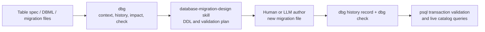

# v0.4.0 Migration Context and Schema History Design

## 1. Purpose

v0.4.0 changes `dbg` from an automatic DDL authoring direction to a deterministic database-change context and history tool.

Database migrations are not simple translations of a Markdown table specification. They can require data backfill, staged constraint validation, foreign-key ownership changes, compatibility retention, rollback design, and live catalog inspection. Those decisions remain the responsibility of a dedicated AI skill and reviewer.

`dbg` remains responsible for deterministic repository evidence:

- table specification parsing and bounded edits;
- ordered migration-chain inventory;
- semantic change history;
- affected-artifact and migration-context collection;
- version-file reservation/scaffolding;
- companion-artifact and validator checks.

`dbg` never connects to or applies changes to a database. `AuditReport.live_database_state` remains `not_checked`.

## 2. Decision Summary

| Area | v0.3.x | v0.4.0 decision |
| --- | --- | --- |
| `generate-ddl` | Markdown-based PostgreSQL CREATE/ALTER generation | Remove from the supported public workflow. Do not generate executable DDL from a table specification. |
| Migration authoring | CLI-generated SQL may be written to a new migration | `database-migration-design` skill designs the migration from deterministic context and live catalog evidence. |
| `ddl-manage` | Infers a version from generic migration artifacts | Use explicit profile-defined migration series and create only an empty/headered migration file. |
| `edit-spec` | Opt-in direct Markdown edit | Keep dry-run default and explicit `--write`; record or verify a semantic history event for each persisted change set. |
| `diff` | Effective schema comparison | Keep read-only, but require a profile-selected Markdown format adapter before treating a diff result as authoritative. |
| Schema history | Git files only | Add immutable semantic events linked to Git-visible artifacts and validation evidence. |

## 3. Scope

### In scope

- `dbg history` append-only semantic event commands;
- `dbg migration-context` read-only structured context command;
- profile-defined migration series;
- profile-selected Markdown table-spec format adapters;
- a new `database-migration-design` Agent Skill;
- compact text and JSON output for agent use;
- pre-commit-compatible history verification.

### Out of scope

- database connections, DDL application, rollback execution, or live catalog inspection;
- automatic generation of executable `CREATE TABLE` or `ALTER TABLE` SQL;
- automatic modification of DBML or existing migration SQL;
- replacing Git as the repository/file history authority.

## 4. Responsibility Boundary



### `dbg`

`dbg` produces deterministic evidence and bounded document edits. It may create new history event files and new empty migration file headers only after an explicit write command. It does not write executable migration statements.

### `database-migration-design` skill

The skill consumes `dbg migration-context` output, current table documents, the relevant migration chain, and user-provided live catalog evidence. It must produce:

1. change intent and compatibility assumptions;
2. ordered migration steps;
3. backfill/copy/bridge plan before destructive changes;
4. preflight, transaction, and post-apply verification SQL;
5. rollback or explicit non-reversibility statement;
6. companion documentation and runtime/API impact list.

The skill does not apply DDL. It must state when live catalog evidence is missing.

## 5. `dbg history`

### 5.1 Storage

History events are committed repository artifacts. The profile defines one directory:

```toml
[history]
directory = ".db-governance/history"
require_event_for_semantic_changes = true
```

Each event is a separate immutable JSON file:

```text
.db-governance/history/
  2026/07/22/
    20260722T143000Z_01J...json
```

One file per event avoids JSONL merge conflicts during parallel work. Git commit history remains the source of truth for file versions; history events provide searchable semantic meaning.

### 5.2 Event contract

```json
{
  "event_id": "01J...",
  "recorded_at": "2026-07-22T14:30:00Z",
  "tool_version": "0.4.0",
  "base_commit": "abc123",
  "table": "EVBP_MGT.POR_DATA_STORE",
  "operations": [
    {
      "kind": "ADD_COLUMN",
      "column": "RUN_TIME",
      "before": null,
      "after": {"type": "VARCHAR(5)", "nullable": true}
    }
  ],
  "artifacts": {
    "table_docs": ["데이터베이스/MGT/EVBP_MGT.POR_DATA_STORE.md"],
    "dbml": ["데이터베이스/MGT/MGT.dbml"],
    "migrations": ["데이터베이스/DDL/V1_30__example.sql"],
    "change_history": ["데이터베이스/변경이력.md"]
  },
  "validation": {
    "check_verdict": "PASS",
    "project_validators": ["evbp-ddl-version-contract"]
  }
}
```

Events are created from the staged semantic diff, not only from `edit-spec`, so manually edited definitions are covered as well.

### 5.3 Commands

```bash
# Preview semantic events inferred from staged files.
dbg history record --staged

# Write immutable event files after a passing contract check.
dbg history record --staged --write

# Find events affecting one object.
dbg history list --table EVBP_MGT.POR_DATA_STORE --format json

# Ensure every staged semantic DB change has a matching event.
dbg history verify --staged
```

`history record --write` must fail when `dbg check` has error findings. `history verify` is suitable for a pre-commit hook but does not run Git commands that create commits.

## 6. `dbg migration-context`

`migration-context` is read-only and exists to reduce agent context gathering. It does not write DDL.

```bash
dbg migration-context \
  --project . \
  --table EVBP_MGT.POR_DATA_STORE \
  --base origin/main \
  --format json
```

The result contains only high-signal data:

- normalized before/after table specification delta;
- matching history events;
- relevant baseline and ordered migration filenames;
- DBML and repository dependency hits;
- configured companion artifacts and validators;
- unresolved items requiring live database evidence.

The text format is summary-first. The JSON format is the stable interface for the migration-design skill.

## 7. Profile Extensions

Generic artifact globs must not be used to infer migration ownership. Profiles declare migration series explicitly.

```toml
[[migration_series]]
name = "main"
directory = "데이터베이스/DDL"
file_pattern = "V1_{number}__{slug}.sql"
number_start = 1

[[migration_series]]
name = "stg"
directory = "데이터베이스/STG/DDL"
file_pattern = "V1_{number}__{slug}.sql"
number_start = 0
```

`dbg ddl-manage --series main --next-version` must only inspect the configured `main` directory. `--create` creates a new file with a comment header containing the selected series, version, and creation time; it does not add executable DDL.

Profiles also select a Markdown adapter. A generic simple-table adapter is retained, while repository profiles may declare explicit headers:

```toml
[table_spec_adapter]
column_section_heading = "컬럼 정의"
name_header = "컬럼명"
type_header = "데이터 타입"
nullable_header = "Null"
primary_key_header = "PK"
description_header = "설명"
```

If the configured adapter cannot parse a table unambiguously, `edit-spec`, `diff`, and `migration-context` must fail closed with a new configuration/parse finding. They must not infer a type from a column name.

## 8. Command Changes

| Command | v0.4.0 behavior |
| --- | --- |
| `dbg edit-spec` | Dry-run by default. `--write` performs a bounded AST edit of the configured table-spec section only. `remove-column` additionally requires `--yes`. |
| `dbg diff` | Read-only effective-schema audit. Returns parser errors rather than false schema findings when a format adapter does not match. |
| `dbg ddl-manage` | Uses only `[migration_series]`; creates header-only files. |
| `dbg generate-ddl` | Removed from the public CLI and documented as unsupported. |
| `dbg history` | New append-only semantic event API. |
| `dbg migration-context` | New read-only agent context API. |
| `dbg check` | Optionally requires `history verify` for semantic DB changes when the profile enables it. |

## 9. Safety Rules

- No `dbg` command connects to a database or runs SQL against one.
- Existing Markdown definitions can change only through explicit `edit-spec --write`; a dry-run and a unified diff are mandatory output before the write.
- Existing DBML and migration SQL are never overwritten by `dbg`.
- Migration files are created only as new header-only files through `ddl-manage --create`.
- History events are new immutable files; existing events are never edited or deleted by the CLI.
- `render --output` must reject an existing output file unless a future explicit `--overwrite` option is supplied.

## 10. Delivery Order

1. Correct v0.3.x safety documentation and mark `generate-ddl` deprecated.
2. Add profile migration-series and table-spec-adapter models with validation.
3. Fix `ddl-manage` to use the explicit series configuration.
4. Implement normalized table-spec parsing and adapter fixtures, including Korean-header fixtures.
5. Rebuild `diff` on normalized models and composite key constraints.
6. Implement `history record/list/show/verify` with staged-diff fixtures.
7. Implement `migration-context` JSON/text output.
8. Add `database-migration-design` skill and update `database-governance` to route migration authoring to it.
9. Add pre-commit integration examples, full CLI/skill docs, and release migration notes.

## 11. Acceptance Criteria

- A profile with `main` and `stg` series returns different target directories and correct next versions.
- A Korean-header table specification parses `컬럼명`, `데이터 타입`, `Null`, and `PK` correctly.
- A composite primary key renders as one table-level constraint in the normalized model; no executable DDL is generated by `dbg`.
- An ambiguous Markdown format fails closed instead of emitting `DBG203`/`DBG204` false positives.
- A semantic staged change without a history event fails `dbg history verify` when required by profile.
- `migration-context --format json` contains no live database claim and declares live evidence as required when applicable.
- `dbg check` and all new default text commands keep summary-first output; JSON output remains stable and complete.
- `uv run ruff check .`, `uv run basedpyright src`, `uv run pytest --cov=db_governance --cov-report=term-missing`, and `uv build` pass.

## 12. EVBP Validation Fixture

The release fixture must include an EVBP-style profile and `POR_COMMON_CODE` specification with this header shape:

```text
No | 컬럼명 | 컬럼한글명 | 데이터 타입 | Null | Default | PK | ... | 설명 | 비고
```

The fixture verifies:

- `VARCHAR(30)` is parsed as the type, not `TYPE` or `CODE`;
- `NAME` is recognized as documented;
- composite key `TYPE, CODE` is retained in the normalized model;
- `main` resolves to `데이터베이스/DDL` and `stg` resolves to `데이터베이스/STG/DDL`.
